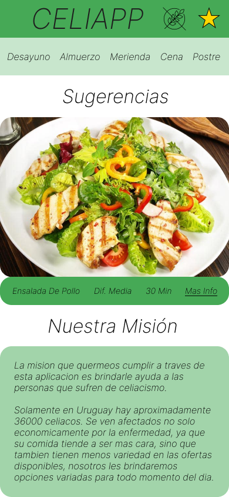
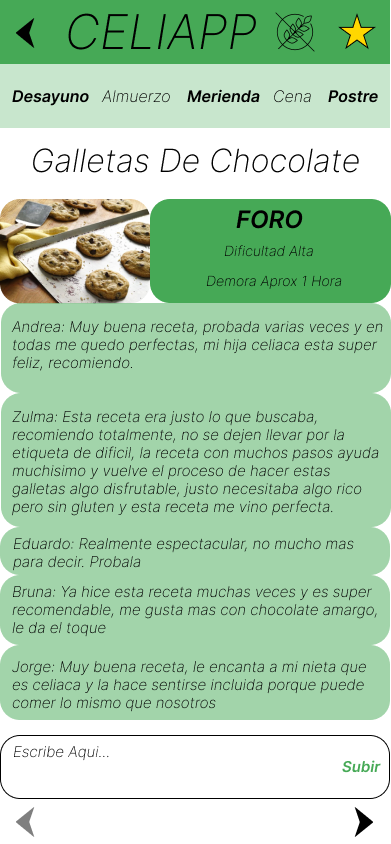
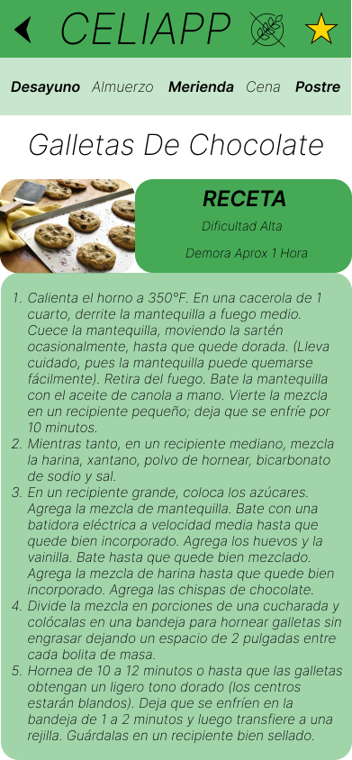

  Informe academico Entrega 1
  

| **Identificación** |
|----------|
| Fundamentos en Ingenieria de Sofware    |
| M4B - Docente Alejandro Adorjan    |
| Joaquin Rega, Agustin Robaina, Nicolas Tormbotti    |

# Objetivo
 
A través de este proyecto buscamos de alguna manera simplificar la vida de las personas que sufren de celiaquía. Aproximadamente 30,000 personas padecen esta enfermedad en Uruguay, y esta estadística no toma en cuenta a los familiares que también se ven afectados porque tienen que cambiar su dieta. En Uruguay, las personas celiacas gastan un 300% más en su alimentación. Otro problema que se presenta es la poca variedad de platos que terminan consumiendo, no porque no exista diversidad, sino porque los alimentos más conocidos suelen contener gluten y se dejan de lado.

La aplicación no va a resolver directamente estos problemas económicos, pero apuntamos a simplificar el proceso de descubrir nuevos y variados menús para cada comida del día. También buscamos crear una especie de comunidad de celiacos donde cada uno pueda dar su opinión sobre cada plato o sugerir alternativas.

# Glosario

***Celiquía :***  enfermedad digestiva que daña el intestino delgado y altera la absorción de las vitaminas, minerales y demás nutrientes que contienen los alimentos. Los pacientes con enfermedad celíaca no toleran una proteína llamada gluten

***Elicitación :*** proceso de identifiación de necesidades y restricciones de distintos interesados para un sistema de software.

***Requerimiento Funcional :*** descripción de cómo se debe comportar el sistema o de una propiedad o atributo del sistema.

***Requerimiento NO Funcional :*** característica del sistema que no se desarrollará ya que se asume o está disponible. Por ejemplo, si una app necesita el uso de WiFi no tendremos que desarollar WiFi también al crear la app, sino que se asume resuelto.

***Use Cases:*** descripción generalizada de un conjunto de interacciones entre el sistema y uno o más actores, donde un actor puede ser tanto un usuario como otro sistema

***Use Stories:*** describe una funcionalidad simple y átomica que será de valor para el usuario o comprador del sistema o software.

***User Person:***  son representaciones ficticias de grupos de usuarios que comparten características y necesidades similares. Estas representaciones ayudan a los equipos de diseño y desarrollo a comprender mejor a su audiencia objetivo y a tomar decisiones informadas durante el proceso de creación de productos.

***Software :*** instrucciones (programas de computadora) que cuando se ejecutan proporcionan la función y rendimiento deseados. 

***Bocetos IU :*** versión preliminar de un posible diseño que tendrá la interfáz de usuario de la aplicación.

***IU:*** espacio donde ocurre la interacción entre el humano y la computadora.

  # Repositorio GIT
  
Para llevar a cabo el versionado del proyecto utilizamos la herramienta GIT, que es un sistema de control de versiones distribuido, la cual permite el desarrollo no lineal y offline. Facilitando el trabajo y organización a la hora de trabajar en equipos. 

  ## Creacion y uso de respositorios locales y remotos
   * Para la creacion del repositorio utilizamos el template propocionado por el docente. Una vez creado el repositorio cada uno de los integrantes del equipo trabajara en un su repositorio local utilizando check-in y check-out al respositorio remoto compartido.
  
  ## Comandos 
  * git clone
    * Lo utilizamos para crear una copia local de un repositorio remoto de Git. Cuando se ejecuta este comando, se descarga una copia completa del repositorio remoto en nuestra computadora y se crea una copia local del repositorio. Puede trabajar en la copia local del repositorio y hacer cambios en el código sin afectar el repositorio remoto.
* git add .
    * Agrega todos los archivos nuevos y modificados al área de preparación de Git.
* git status
    * Lo utilizamos para ver qué archivos están en el área de preparación y cuáles no.
* git commit -m "mensaje"
    * Git confirma los cambios en el repositorio local y agrega un mensaje de confirmación que describe los cambios realizados. El mensaje de confirmación es útil para para mantener un historial de cambios en el código.
* git log
    * Muestra una lista de todas las confirmaciones realizadas en el repositorio local, es útil para mantener un registro de los cambios realizados en el código y para revertir los cambios si es necesario.
* git pull
    * Sirve para actualizar el repositorio local de Git con los cambios realizados en el repositorio remoto, Git descarga los cambios realizados en el repositorio remoto y los fusiona con el repositorio local.
* git push
    * Se utiliza para enviar los cambios confirmados en el repositorio local de Git al repositorio remoto.
* git branch "nombre de la rama"
    * Crea una rama nueva con el nombre que le pongamos.

    En nuestro caso para realizar la parte de documentación del proyecto realizamos una rama llamada documentación.

    `` git branch documentacion ``

* git branch
    * Muestra una lista de todas las ramas en el repositorio local y resalta la rama actual.
* git checkout
    * Lo utilizamos para cambiar entre las distintas ramas.
* git merge
    * Fusiona dos ramas en el repositorio local de Git.

# Versionado
## Buenas prácticas

* Las buenas prácticas de Git son importantes para cualquier desarrollador de software y pueden ayudar a garantizar que el código sea fácil de mantener y actualizar. Algunas buenas prácticas de versionado de Git incluyen:

## Uso de ramas separadas de "main"

* Hacer commits pequeños y frecuentes, en lugar de grandes y poco precisos.
* El versionado de Git es una herramienta importante para cualquier desarrollador de software como explicamos en la parte anterior. Por lo tanto, utilizaremos distintas ramas para cada parte del proyecto.

## Resumen de commits y evolución del proyecto

* Realizar pruebas antes de realizar el commit para asegurarse de que el código funcione correctamente.
* Escribir mensajes de commits claros que describan lo realizado en el código.
* En nuestro caso como buena práctica  decidimos utilizar la convención "Conventional Commits" para faciliar la legibilidad y    entendimiento de los distintos commits realizados. 
[Conventional Commits](https://www.conventionalcommits.org/en/v1.0.0/)

[Commits Realizados](https://github.com/IngenieriaSoftwareTeam/obligatorio1-Nicolas-Trom-Joaquin-Rega-Agustin-Robaina/commits/documentacion)

# Elicitación

### Investigación:

La primera técnica de elicitación que decidimos usar fue la investigación ya que ninguno de los intergrantes del grupo tenía muy presente la condición de la celiaquía. Por lo cual realizamos un trabajo de investigación basándonos en diversas páginas que tuvieran un contenido avalado. Para así empezar a profundizar en el tema e identificar las primeras necesidades que podría tener un cliente potencial de nuesetra aplicación.

* La celiaquía es una enfermedad digestiva que daña el intestino delgado y altera la abosrbción de las vitaminas, minerales y demás nutrientes que contienen los alimentos. 

*  Algunas de las consecuencias de la enfermedad son : deficit nutricionales , bajo peso, retraso en el crecimiento.

* Es una enfermedad difícil de diagnosticar.

* Una de cada cien personas es celíaca en Uruguay.

* El precio de los productos sin glúten puede llegar a ser hasta 87 % mas cáros.

[Fuentes utilizadas para la investigación](elicitación/investigación.md)

### Entrevista:

La siguiente técnica de elicitación que utilizamos fue la entrevista. En nuestro caso realizamos dos entrevistas a personas celíacas, cada una con perfiles y edades distintas para así obtener una perspectiva mas amplia de la condición y poder identificar la mayor cantidad de necesidades por parte de los potenciales usuarios.

Para realizar la entrevista decidimos basarnos en un prototipo de pregutnas, las cuales son abiertas para así no sesgar o forzar las respuestas y que el entrevistado pudiera explayarse en sus respuestas. 

A través de la entrevistas de las entrevistas realizadas obtuvimos las siguientes conclusiones:

* Las dificultades que se presentan a la hora de cocinar son el costo de los ingredientes y la preparación de las recetas, ya que son mas elaboradas al tener que utilizar otros tipos de harina que no contengan gluten.

* A la hora de buscar recetas en internet estas no son claras ni precisas.

* Una de los entrevistados nos comentó que le gustaría encontrar recetas que son difíciles de adaptar en una dieta sin gluten.

* A la hora de comprar hay baja disponibilidad y variedad de productos aptos para celíacos comparado con los que tienen glúten.

* En el caso de comer fuera de casa hay poca oferta de restaurantes que tengan un menú apto para celíacos o de locales de venta de comida sin glúten.

[Link preguntas de las preguntas prototipadas](elicitación/entrevista.md)

### LLuvia de ideas: 

Finalemente, basándonos en la información recolectada a través de la téncnica de investigación y la entrevista hicimos una lluvia de ideas para determinar features de la aplicación y el alcance de la misma.
Algunos puntos que se definieron fueron los siguientes:

* El sistema mostrará sugerencia de recetas que se encuentran disponibles

* El usuario podrá filtar las recetas por dificultad de y tiempo estimada de la misma.

* El usuario podrá agregar comida a favoritos

* Recomendación de locales que vendan productos aptos para celíacos

# Categorización de Usuarios: User Personas

.jpg)

.jpg)

.jpg)
# Modelo Conceptual del Problema

# Historia de Usuarios

## Historias de Usuario 1

### Titulo: Filtrar por Dificultad
* **Para** saber que tan dificl puede ser la receta
* **Como** usuario
* **Quiero** poder filtrar recetas por dificultad

### Criterios de Aceptación:
* El usuario debera estar en una de las pestañas de las comidas del dia 

## Historias de Usuario 2

### Titulo: Agregar a Favoritos

* **Como** usuario
* **Quiero** poder agregar a favoritos un plato en especifico
* **Para** poder visualizarlo mas tarde

### Criterios de Aceptación:
* Una misma receta no podra estar agregada dos veces

## Historias de Usuario 3

### Titulo: Interactuar en el Foro

* **Como** usuario
* **Quiero** poder comparir y leer resañas sobre las recetas 
* **Para** conocer distintas opinones sobre la misma

### Criterios de Aceptación:
* Debera llenar un formulario con datos de su nombre y direcciòn de correo
* Debe estar conectado a Internet

# Especificaión
## Requerimientos Funcionales (RF)

### RF 1: Agregar a Favorito
**Actor :** Usuario

**Descripcion :** El usuario podrá agregar una receta a su lista de favoritos

**Prioridad :** Baja

### RF 2: Filtrar por comida del día
**Actor :** Usuario

**Descripcion :** El usuario podrá filtrar las recetas según la comida del día.

**Prioridad :** Media

### RF 3: Ingreso a la Aplicacion
**Actor :** Usuario

**Descripcion :** Al ingresar a la aplicacion  mostrará sugerencias de recetas.

**Prioridad :** Media

### RF 4: Filtrar por Dificultad
**Actor :** Usuario

**Descripcion :** El usuario podrá filtrar las recetas según la dificultad de la misma.

**Prioridad :** Alta

### RF 5: Filtrar por Tiempo Estimado
**Actor :** Usuario

**Descripcion :** El usuario podrá filtrar las recetas según el tiempo estimado de la misma.

**Prioridad :** Alta

### RF 6: Foro 
**Actor :** Usuario

**Descripcion :** El usuario podrá interactuar e intercambiar ideas con otros usarios.

**Prioridad :** Media

### RF 7: Recetas 
**Actor :** Usuario

**Descripcion :** El usuario podrá ver la receta de un plato con instrucciones de como prepararla.

**Prioridad :** Alta

## Requerimientos No Funcionales (RNF)

### RNF 1:  Idiomas
**Descripcion :** El sistema debera soportar los idiomas español e inglés.

**Prioridad :** Baja

### RNF 2:  Multiplataforma
**Descripcion :** El sistema deberá correr en Windows 7 en adelante, Android 5 en adelante, IOS 10 en adelante.

**Prioridad :** Media

### RNF 3:  Lenguajes
**Descripcion :** El sistema deberá ser desarrollado en ECMAScript6, HTML5 y CSS3.

**Prioridad :** Media

### RNF 4 : Responsive
**Descripción :** El sistema deberá ser accesible desde dispositivos móviles y computadoras.

**Prioridad :** Media

# USE CASES 
## Caso de uso 1
### Actor:
Usuario
### Referencia a RF:
RF1
### Imagenes:
Imagen 1 y 3
### Pre condicion:
No hay
### Pos condicion:
La aplicacion 
agrega a la lista de favoritos el plato elegido
| **Accion de los actores:**| **Respuesta del sistema:**|
|-|-|
| 1. El usuario abre la aplicacion| 2. El sistema muestra el menu de inicio con botones para todos los alimentos del dia |
| 3. El usuario aprieta el boton que dice desayuno | 4. El sistema muestra todas las recetas que estan asociadas con el desayuno|
|4. El usuario aprieta la estrella de una receta que no tenga la estrella dorada|5. La estrella se vuelve dorada significando que se agrego correctamente a la lista de favoritos|

|2 |4 y 5|
|-|-|
| |  |

### Curso Alternativo
* **4.1 :** Usuario aprienta una estralla ya dorada
* **4.2 :** Sistema vuelve la estrella a su color original
* **4.3 :** Sistema quita la receta de favoritos

## Caso de uso 2
### Actor:
Usuario
### Referencia a RF:
RF2
### Imagenes:
Imagen 1 y 3
### Pre condicion:
No hay
### Pos condicion:
La aplicacion muestra las recetas que son para ese alimento del dia

| **Accion de los actores:**| **Respuesta del sistema:**|
|-|-|
| 1. El usuario abre la aplicacion| 2. El sistema muestra el menu de inicio con botones para todos los alimentos del dia |
| 3. El usuario aprieta el boton que dice desayuno | 4. El sistema muestra todas las recetas que estan asociadas con el desayuno|

|2 |4|
|-|-|
| |  |

## Caso de uso 3
### Actor:
Usuario
### Referencia a RF:
RF3
### Imagenes:
Imagen 1
### Pre condicion:
No hay
### Pos condicion:
La aplicacion muestra sugeridos
| **Accion de los actores:**| **Respuesta del sistema:**|
|-|-|
| 1. El usuario abre la aplicacion| 2. El sistema muestra el menu de inicio con platos sugeridos |

|2|
|-|
| |

## Caso de uso 4
### Actor:
Usuario
### Referencia a RF:
RF4 y RF5
### Imagenes:
Imagen 3, 4 y 5
### Pre condicion:
El usuario esta en una seccion con una lista de platos
### Pos condicion:
La aplicacion permite filtrar por dificultad y por tiempo estimado de preparacion
| **Accion de los actores:**| **Respuesta del sistema:**|
|-|-|
| 1. El usuario aprieta el icono de filtros| 2. El sistema muestra una ventana con opciones para filtrar |
|3. El usuario elige la dificultad y rango de tiempo que quiere y aprieta en aplicar filtros|4. La lista seleccionada anteriormente se filtra entre los platos que cumplen los requerimientos pedidos|

|1 |2|
|-|-|
| | |
|4||
|||

### Curso Alternativo
* **3.1 :** Usuario selecciona una dificultad o rango de tiempo para el cual no existen recetas
* **3.2 :** Sistema muestra lista vacia

## Caso de uso 5
### Actor:
Usuario
### Referencia a RF:
RF6
### Imagenes:
Imagen 6 y 8
### Pre condicion:
El usuario esta en una seccion de mas info sobre un plato
### Pos condicion:
La aplicacion permite mostrar el foro en donde los usuarios pueden comentar sobre cada receta
| **Accion de los actores:**| **Respuesta del sistema:**|
|-|-|
| 1. El usuario cliquea en el boton de foro| 2. El sistema muestra una un formulario a llenar|
|3. El usuario completa los campos | 4. Sistema valida los campos|
|5. Usuario realiza el comentario | 6. Sistema publica el comentario|

|1 |2|
|-|-|
| | |

### Curso Alternativo
* **3.1 :** Usuario no llena todos los campos
* **3.2 :** Sistema muestra error avisandole al usuario que tiene que rellenar todos los datos

## Caso de uso 6
### Actor:
Usuario
### Referencia a RF:
RF7
### Imagenes:
Imagen 6 y 7
### Pre condicion:
El usuario esta en una seccion de mas info sobre un plato
### Pos condicion:
La aplicacion le muestra al usuario una receta detallada sobre el plato elegido
| **Accion de los actores:**| **Respuesta del sistema:**|
|-|-|
| 1. El usuario aprieta en el boton de receta| 2. El sistema muestra la seccion de la receta|

|1 |2|
|-|-|
| | |

# Bocetos de la intefraz grafica
|||
|-|-|
|**Menu - 1**|**Favoritos - 2**|
|||
|**Desayunos - 3**|**Filtro - 4**|
|||
|**Desayunos filtrados - 5**|**Mas info sobre galletas - 6**|
|||
|**Receta de las galletas - 7**|**Foro de las galletas - 8**|
|||

# Validación y Verificación

## Validación del Prototipo
El prototipo fue presentado a Cecilia Rega, una persona celiaca, para que lo probara y nos diera su opinión. Cecilia quedó muy conforme con el prototipo, le gusto mucho la idea de poder tener una aplicación que le permita encontrar recetas nuevas y variadas. Hizo hincapie en que le gusto que la aplicacion sea "sencilla". Nos recomendo cambiar la paleta de colores y que las recetas tengan distintas colores segun la dificultad de la misma. Tambien nos recomendo que la aplicacion tenga un buscador para poder buscar recetas especificas.
Todas estas sugerencias las tendremos en cuenta a la hora de realizar el producto final. 

## Verificacióon de requerimientos
| **Requerimientos**                                 | RF1 | RF2 | RF3 | RF4 | RF5 | RF6 | RF7 |
|----------------------------------------------------|-----|-----|-----|-----|-----|-----|-----|
| **Correctitud**                                    |     |     |     |     |     |     |     |
| ¿Es viable?                                        | SI  | SI  | SI  | SI  | SI  | SI  | SI  |
| ¿Están  correctamente priorizados?                 | SI  | SI  | SI  | SI  | SI  | SI  | SI  |
| ¿Están los usuarios identificados?                 | SI  | SI  | SI  | SI  | SI  | SI  | SI  |
| ¿No hay conflictos con otros  requerimientos?      | SI  | SI  | SI  | SI  | SI  | SI  | SI  |
| ¿No incluye aspectos de diseño o  implementación?  | SI  | SI  | SI  | SI  | SI  | SI  | SI  |
| ¿Esta dentro del alcance del problema a  resolver? | SI  | SI  | SI  | SI  | SI  | SI  | SI  |
| **Verificabilidad y  no ambigüedad**               |     |     |     |     |     |     |     |
| ¿Es preciso y no  ambigüo?                         | SI  | SI  | SI  | SI  | SI  | NO  | SI  |
| ¿Es verificable?                                   | SI  | SI  | SI  | SI  | SI  | SI  | SI  |

## Verificación de casos de uso
| **Casos de Uso**                                       | Caso 1 | Caso 2 | Caso 3 | Caso 4 | Caso 5 | Caso 6 |
|--------------------------------------------------------|--------|--------|--------|--------|--------|--------|
| ¿Cumple un único objetivo?                             | SI     | SI     | SI     | SI     | SI     | SI     |
| ¿Queda claro quiénes  son los actores?                 | SI     | SI     | SI     | SI     | SI     | SI     |
| ¿Existe una secuencia  lógica de los pasos?            | SI     | SI     | SI     | SI     | SI     | SI     |
| ¿Está libre de detalles  de diseño e implementaciones? | SI     | SI     | SI     | SI     | SI     | SI     |
| ¿Se documentaron todos  los cursos alternativos?       | SI     | NO     | NO     | SI     | SI     | NO     |
# Reflexión

## Detalle del trabajo indivudual.

* **Agustín**: 

En lo personal creo que el obligatorio fue una excelente instancia para aplicar todo lo aprendido en clase y profunidzar en los conceptos vistos. Además de poder ver una parte del desarrollo de software que en lo personal no había tratado anteriormente y me pareció realmente interesante. Ya que generealmente nos centramos en la parte de tecnología y codificación sin prestarle mucha atención a esta etapa ,infravalorada tal vez, de especificación, pero como se nos ha reitrerado en clase los dispositivos y tecnologías que empleamos actualmente en unos años serán obsoletas, pero en cambio este trabajo de especificación es perdurable y aplicable a las tecnologías que se rijan en el momento oportuno.

El trabajo fué realizado de manera conjunta entre los diversos integrantes del grupo. En mi caso me encargué de las técnicas de elicitación de investigación y realizando una de las entrevistas realizadas. Luego participé en la lluvia de ideas que realizamos a través de una discusión de github para poner sobre la mesas posibles features que tendría la aplicación. También participé con la especificación de los requerimientos funcionales y no funcionales.

* **Nicolás**: 

Durante este trabajo, aprendí que la comunicación y la colaboración son clave para el éxito de un proyecto de ingeniería de software. Trabajar en equipo me permitió ver diferentes perspectivas y enfoques, lo que enriqueció nuestro trabajo y nos ayudó a tomar decisiones.

También aprendí sobre la importancia de la planificación cuidadosa y la selección de herramientas adecuadas para maximizar la eficiencia del equipo.

Los avances del proyecto fueron realizados en conjunto, cada uno de los integrantes del grupo aporto ideas y conocimientos para el desarrollo del mismo. En mi caso particular me encargue de la parte del versionado, donde profundizamos en las buenas practicas. Además de realizar los User Pesonas y las Historias de Usuarios. Por último aporte ideas para los requerimientos funcionales y no funcionales, asi como tambien para la verificación y validación de los mismos.

* **Joaquín**:

Esta entrega fue una oportunidad perfecta para poder poner en prueba todo lo que se dio en la clase. Se tuvo que trabajar como equipo en este proyecto y eso ayudo a desarollar habilidades que luego van a ser muy utiles en la vida laboral. 

La comuncación era clave a la hora de organizarnos porque si estabamos mal organizados iba a generar problemas por todas partes, usandon la herramienta git y github pudimos minimizar esos problemas organizativos, la herramienta nos permitio a cada uno editar el archivo a la misma vez resolviendo los conflictos que esto generaria.

El trabajo fue hecho de manera grupal, y todos los integrantes aportaron en todo, obviamente cada uno se enfoco en ciertos aspectos del proyectos.Yo en particular me enfoque en el armado de los bocetos de la interfaz, los use cases y el modelo conceptual del problema, pero ademas contrubuí cosas especificas a las otras partes del trabajo como los requerimientos funcionales y no funcionales como tambien con la elicitacion.

### Técnicas aplicadas y aprendizaje.

En esta instancia de obligatorio tuvimos la oportunidad de aplicar lo aprendido hasta este punto del semestre. Pusimos en práctica las técnicas de elicitación vistas en clase, en nuestro caso fueron la investigación, entrevista y la lluvia de ideas.
También alpicamos lo aprendido de git y github para realizar el versionado del proyecto, lo cual nos resultó muy útil ya que nos permitió trabajar en paralelo y sin la necesidad de realizar llamdas constante para poder avanzar en el obligatorio.

Como conclusión creemos que fue una instancía en donde pudimos aplicar lo aprendido en clase y fortalecer los conceptos vistos. Además de poder trabajar en una parte del desarrollo muy interesante y no vista antes en la carrera hasta el momento.