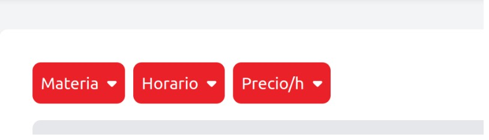
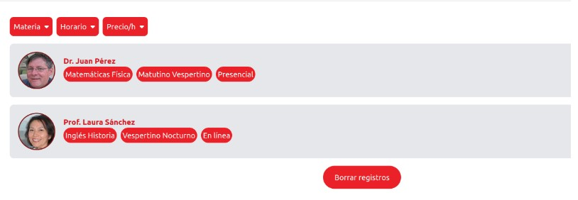

# Objetivos

* Desarrollar la aplicación utilizando las tecnologías definidas 

* Desarrollar la intefaz de usuario siguiendo principios de usabilidad y accesibilidad

* Aplicar prácticas de calidad de código y test unitario

# Construcción

Para el desarrollo de la aplicación utilizamos HTML5 para diseñar la estrucutra de la misma , en conjunto con Boostrap para darle una apariencia mas estética a la página y que sea responsive. Luego para darle funcionalidad a la página utilizamos Javascript ES12, aplicando buenas practicas de POO, separando la parte lógica de la interfaz. A la hora de codificar aplicamos el estándar de Google utilizando la herramienta ESLint.
En cuanto a la parte de test  empleamos el framework Jest para realizar testing unitario sobre cada una de las clases de nuestro proyecto, asegurandonos tener un 100% de cobertura en las clases y de generar buenas pruebas, con el fin de poder asegurarnos del correcto funcionamiento de la aplicación y de poder descubir nuevos errores no esperados.

# Informe de testing 
Proyecto asignado: [https://github.com/IngenieriaSoftwareTeam/obligatorio1-Izquierdo-Preza-Kuster.git]

## Test de sistema

### Testing exploratorio
|  |  |
| -------- | -------- |
| MISIÓN      |    Chequear Funcionalidades  |
| INICIO     | 26/11/2023 16:53     |
| TESTER     |   Joaquin Rega, Agustin Robaina, Nicolas Trombotti  |
| ESTRUCTURA DE DIVISIÓN      | DURACIÓN: Media (60 minutos) DISEÑO Y EJECUCIÓN DE PRUEBAS:65% INVESTIGACIÓN Y REPORTES DE DEFECTOS: 20 % ARMADO DE LA SESIÓN:15% OBJETIVO vs. OPORTUNIDAD: 80/20|
| ARCHIVOS DE DATOS     |      |
| NOTAS DE PRUEBAS     |  1 Presiono Filtro Materia, 2 Presiono Filtro Horario, 3 Presiono Filtro Precio/h, 4 Preciono barra de busqueda, 5 Presiono "Borrar Registros", 6 agrego y borro una reseña |
|DEFECTOS |   1,2,3,4 No tienen Funcionalidad, 5 No queda claro que funcionalidad tiene, 6 la aplicacion no muestra un indicativo cuando se agrega una reseña exitosamente ni cuando se borra, 7 cuando se inicia la apliacion saltan varios errores en la consola del navegador|
| INCONVENIENTES |Desde las 17:00 y hasta las 17:15 el ambiente de pruebas no estuvo disponible, debido a inconvenientes con el servidor web. La sesión se pausó y se retomaron las actividades a partir de las 17:17.    |  
| Link ISSUE | https://github.com/IngenieriaSoftwareTeam/obligatorio1-Izquierdo-Preza-Kuster/issues/57,  https://github.com/IngenieriaSoftwareTeam/obligatorio1-Izquierdo-Preza-Kuster/issues/56, https://github.com/IngenieriaSoftwareTeam/obligatorio1-Izquierdo-Preza-Kuster/issues/59, https://github.com/IngenieriaSoftwareTeam/obligatorio1-Izquierdo-Preza-Kuster/issues/58, https://github.com/IngenieriaSoftwareTeam/obligatorio1-Izquierdo-Preza-Kuster/issues/60  |  

# Informe de Calidad Del Sistema
Habiendo probado y testeado el sistema, pudimos obsevar que el mismo es poco intuitivo y cuenta con una interfaz poca amigable para el usurio. En cuanto a funcionalidades del sistema, el mismo no cumple con lo que se esperaba de el.
Faltan funcionalidades como la de filtrar por materia, horario y precio/hora. En conclusion, la calidad del sistema es baja.

# Reflexiones

## Grupal

Durante todo el trabajo fuimos gradualmente mejorando nuestra habilidad de trabajo en grupo, al principio era dificil e incomodo pero de a poco se volvio muy facil. Todo este trabajo nos enseño varios elementos sobre el desarollo de software que en nuetra vida laboral vamos a poner en practica, aprendimos sobre herramientas nuevas como git, o sobre testing de varios tipos. Creemos que la clave para el resultado obtenido en este proyecto fue la comunicacion, el grupo no solo individualmente trabajaba mucho pero sino que a traves de la comunicacion logramos adquirir un ritmo de trabajo alto y calidad exepcional.

## Individules

* **Joaquin Rega :**

En esta etapa del proyecto mi enfoque de trabajo fue mas hacia la parte de html, css y javascript, aunque hice aportes significativos hacia las otras partes. Use nuevas herramientas como bootstrap que ayudaros mucho a la agilides del proyecto sin dejar de lado calidad de resultado final. Termino este proyecto muy feliz no solo por lo que entregamos sino que tambien cultivamos un grupo de trabajo serio y activo. Creo que esta entrega me ayudo mucho a preparame para lo que se viene en el futuro en la vida laboral.

* **Agustin Robaina :**

Este segundo obligatorio fue una buena oportunidad para refrescar y profundizar en tecnologías vistas previamente como HTML y Javascript.Lo cual siempre es bueno y más aún tratandose de tecnologías usadas frecuentemente en el área de dearrollo. También en esta etapa adquirí conocimientos con lo que respecta a la calidad de código y el testing, que son herramientas y conocimientos fundamentales para poder desarrollar software de calidad.
Por último me parece oportuno destacar el buen trabajo realizado en equipo durante todas las etapas del proyecto, tanto a nivel de productividad como de organización.

* **Nicolas Trombotti :**

En el proceso de desarrollo aprendi y reforcé conocimientos de tecnología que considero útiles para el 
futuro, como pueden ser las herramientas de testing, jest y Eslint las cuales fueron nuevas para mi, además de poner a prueba mis conocimientos previos en JavaScript o HTML.
A diferencia de la primera parte ahora tuvimos que desarrollar en conjunto, lo cual conlleva un aprendizaje que nos servirá en otros proyectos.
Me llevo una buena experiencia de trabajo y muy conforme con la disposición de mis compañeros.
