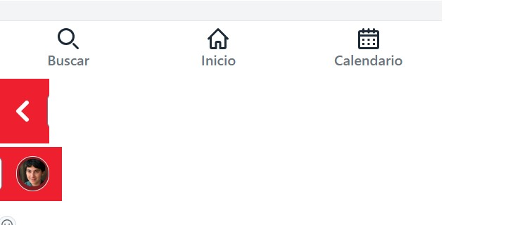

# Informe de testing 
Proyecto asignado: [https://github.com/IngenieriaSoftwareTeam/obligatorio1-Izquierdo-Preza-Kuster.git]

## Test de sistema

### Testing exploratorio
|  |  |
| -------- | -------- |
| MISIÓN      |    Chequear Funcionalidades  |
| INICIO     | 26/11/2023 16:53     |
| TESTER     |   Joaquin Rega, Agustin Robaina, Nicolas Trombotti  |
| ESTRUCTURA DE DIVISIÓN      | DURACIÓN: Media (60 minutos) DISEÑO Y EJECUCIÓN DE PRUEBAS:65% INVESTIGACIÓN Y REPORTES DE DEFECTOS: 20 % ARMADO DE LA SESIÓN:15% OBJETIVO vs. OPORTUNIDAD: 80/20|
| ARCHIVOS DE DATOS     |     |
| NOTAS DE PRUEBAS     |  1 Presiono Filtro Materia, 2 Presiono Filtro Horario, 3 Presiono Filtro Precio/h, 4 Preciono barra de busqueda, 5 Presiono "Borrar Registros" |
|DEFECTOS |   1,2,3,4 No tienen Funcionalidad, 5 No queda claro que funcionalidad tiene           |
| INCONVENIENTES |Desde las 17:00 y hasta las 17:15 el ambiente de pruebas no estuvo disponible, debido a inconvenientes con el servidor web. La sesión se pausó y se retomaron las actividades a partir de las 17:17.    |  
| Link ISSUE | https://github.com/IngenieriaSoftwareTeam/obligatorio1-Izquierdo-Preza-Kuster/issues/57,  https://github.com/IngenieriaSoftwareTeam/obligatorio1-Izquierdo-Preza-Kuster/issues/56, https://github.com/IngenieriaSoftwareTeam/obligatorio1-Izquierdo-Preza-Kuster/issues/59  |  

## Informe de Calidad Del Sistema
Habiendo probado y testeado el sistema, pudimos obsevar que el mismo es poco intuitivo y cuenta con una interfaz poca amigable para el usurio. En cuanto a funcionalidades del sistema, el mismo no cumple con lo que se esperaba de el.
Faltan funcionalidades como la de filtrar por materia, horario y precio/hora. En conclusion, la calidad del sistema es baja.

## Reflexiones

### Grupal
Durante todo el trabajo fuimos gradualmente mejorando nuestra habilidad de trabajo en grupo, al principio era dificil e incomodo pero de a poco se volvio muy facil. Todo este trabajo nos enseño varios elementos sobre el desarollo de software que en nuetra vida laboral vamos a poner en practica, aprendimos sobre herramientas nuevas como git, o sobre testing de varios tipos. Creemos que la clave para el resultado obtenido en este proyecto fue la comunicacion, el grupo no solo individualmente trabajaba mucho pero sino que a traves de la comunicacion logramos adquirir un ritmo de trabajo alto y calidad exepcional.

### Joaquin Rega

### Agustin Robaina

### Nicolas Trombotti
